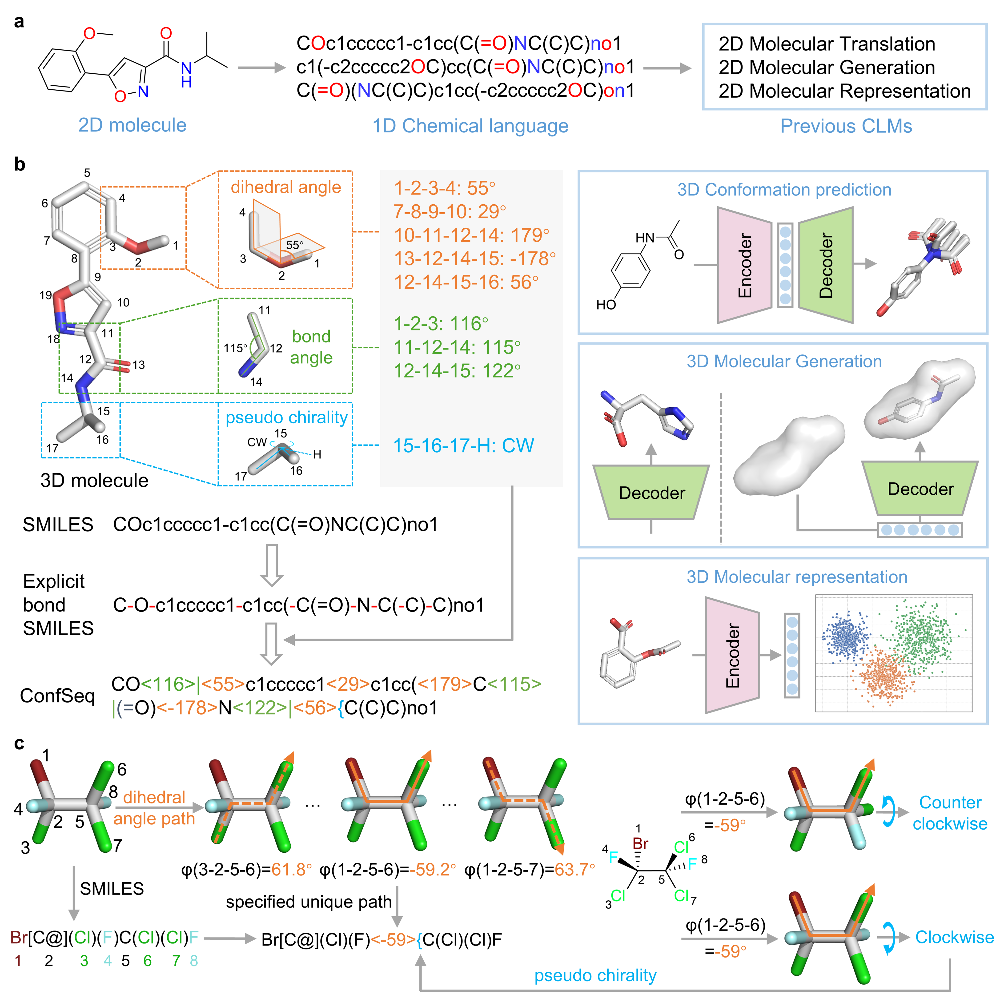

# ConfSeq

This repository accompanies the paper
**“Bridging 3D Molecular Structures and Artificial Intelligence by a Conformation Description Language.”**



We provide ready-to-use ConfSeq-series models online at [Sciminer](https://sciminer.protonunfold.com/), including:

* **Molecular Conformation Generation**: [ConfSeq-Conf-Gen](https://sciminer.protonunfold.com/utility?tool=Confseq%20Conf%20Gen)
* **Shape-conditioned Generation**: [ConfSeq-Shape-Gen](https://sciminer.protonunfold.com/utility?tool=ConfSeq%20Shape%20Gen)
* **Shape Screening Based on ConfSeq**: [ConfSeq-Shape-Screen](https://sciminer.protonunfold.com/utility?tool=ConfSeq%20Shape%20Screen)

---

## 📦 Environment Setup

We strongly recommend creating a dedicated Conda environment to manage dependencies. Execute the following commands to create an environment named `confseq` with Python 3.11 and CUDA 12.6:

```bash
conda create -n confseq python=3.11 -y
conda activate confseq

conda install pytorch==2.4.1 torchvision==0.19.1 torchaudio==2.4.1 pytorch-cuda=12.4 -c pytorch -c nvidia -y

pip install rdkit==2024.9.3 transformers==4.50 accelerate==1.8.1
pip install jupyter epam.indigo==1.32.0 SmilesPE==0.0.3 posebusters==0.4.4 timeout_decorator==0.5.0 fcd_torch==1.0.7 easydict==1.13 py3dmol==2.5.1 swanlab==0.6.4 lmdb==1.6.2 scikit-image==0.25.2 matplotlib==3.10.3 seaborn==0.13.2

conda install openbabel -c conda-forge -y
conda install ninja -y

pip install "git+https://github.com/facebookresearch/pytorch3d.git"
pip install oddt==0.7
pip install ./shape_conditioned_generation/src/model/pointops
```

> [!NOTE]
> If you encounter a CUDA version mismatch, set the following environment variables to match your installed CUDA version:
>
> ```bash
> export PATH=/usr/local/cuda-12.9/bin:$PATH
> export LD_LIBRARY_PATH=/usr/local/cuda-12.9/lib64:$LD_LIBRARY_PATH
> ```
>
> If you experience issues installing `pointops`, refer to the [Pointcept issue page](https://github.com/Pointcept/Pointcept/issues) for troubleshooting.

Alternatively, a pre-packaged Conda environment is available [here](mylink) for streamlined installation.

---

## 📝 Demo

A demonstration notebook illustrating how to convert a 3D molecule to a ConfSeq sequence and reconstruct it back is provided in the `demo` directory. The core implementation of the ConfSeq algorithm is located in `demo/ConfSeq.py`.

---

## 📦 Resources

The datasets and pretrained model checkpoints are hosted at [this Zenodo link](link).

---

## 🚀 Running the Models

The ConfSeq-series models are organized into subdirectories, each corresponding to a specific task described in the paper. Each subdirectory contains a `README.md` with detailed usage instructions.

Please refer to these documents to run individual models.

---

## ⭐ Star History

[](https://www.star-history.com/#jiachengxiong/ConfSeq&Date)

---

## 📖 Citation

If you find this code helpful for your research, please cite our paper:

```bibtex
@article{Xiong2025.05.07.652440,
  author = {Xiong, Jiacheng and Shi, Yuqi and Zhang, Wei and Zhang, Runze and Chen, Zhiyi and Zeng, Chuanlong and Jiang, Xun and Cao, Duanhua and Xiong, Zhaoping and Zheng, Mingyue},
  title = {Bridging 3D Molecular Structures and Artificial Intelligence by a Conformation Description Language},
  elocation-id = {2025.05.07.652440},
  year = {2025},
  doi = {10.1101/2025.05.07.652440},
  publisher = {Cold Spring Harbor Laboratory},
  URL = {https://www.biorxiv.org/content/early/2025/05/12/2025.05.07.652440},
  eprint = {https://www.biorxiv.org/content/early/2025/05/12/2025.05.07.652440.full.pdf},
  journal = {bioRxiv}
}
```

