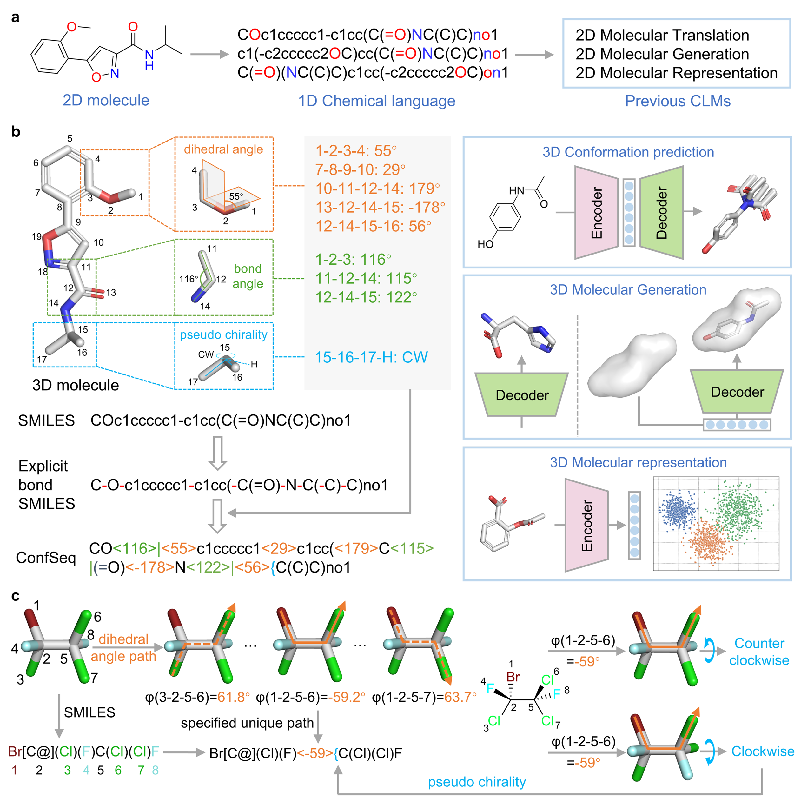

# ConfSeq

This is the official repository for the paper:
**“Bridging 3D Molecular Structures and Artificial Intelligence by a Conformation Description Language.”**



We also provide the ready-to-use ConfSeq-series models online at [Sciminer](https://sciminer.protonunfold.com/), including:
- **Molecular conformation generation**: [ConfSeq-Conf-Gen](https://sciminer.protonunfold.com/utility?tool=Confseq%20Conf%20Gen).
- **Shape-conditioned Generation**: [ConfSeq-Shape-Gen](https://sciminer.protonunfold.com/utility?tool=ConfSeq%20Shape%20Gen).
- **ConfSeq based Shape Screening**: [ConfSeq-Shape-Screen](https://sciminer.protonunfold.com/utility?tool=ConfSeq%20Shape%20Screen).
  
---

## 📦 Environment Setup

It is recommended to use a Conda environment to install the required dependencies:

```bash
conda env create -f environment.yaml
conda activate confseq
```

---

## 🚀 Running the Models

The ConfSeq-series models are organized into subdirectories, each corresponding to a specific task mentioned in the paper.
The core algorithm of ConfSeq is provided in 
`ConfSeq_3_2.py`.

Please refer to the `README.md` file within each subdirectory for detailed instructions on running the respective models.

---

## ⭐ Star History

[](https://www.star-history.com/#jiachengxiong/ConfSeq&Date)

---

## 📖 Citation

If you find this code useful for your research, please cite our paper:

```bibtex
@article{Xiong2025.05.07.652440,
  author = {Xiong, Jiacheng and Shi, Yuqi and Zhang, Wei and Zhang, Runze and Chen, Zhiyi and Zeng, Chuanlong and Jiang, Xun and Cao, Duanhua and Xiong, Zhaoping and Zheng, Mingyue},
  title = {Bridging 3D Molecular Structures and Artificial Intelligence by a Conformation Description Language},
  elocation-id = {2025.05.07.652440},
  year = {2025},
  doi = {10.1101/2025.05.07.652440},
  publisher = {Cold Spring Harbor Laboratory},
  URL = {https://www.biorxiv.org/content/early/2025/05/12/2025.05.07.652440},
  eprint = {https://www.biorxiv.org/content/early/2025/05/12/2025.05.07.652440.full.pdf},
  journal = {bioRxiv}
}
```

