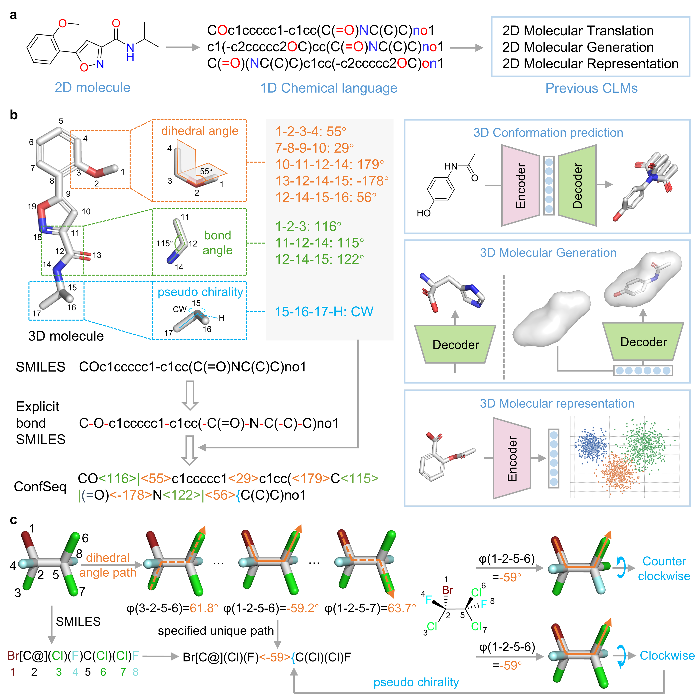

# ConfSeq: Bridging three-dimensional molecular structures and artificial intelligence with a conformation description language

**ConfSeq** introduces a unified language for representing 3D molecular conformations, enabling seamless integration of geometric molecular data with modern sequence-based deep learning architectures.

<p align="center">
  
</p>

---

# 🔗 **Online Access to Pretrained ConfSeq-series Models**

All pretrained ConfSeq models can be accessed directly through **Sciminer**:

| Task                             | Model                  | Link                                                                                                                                               |
| -------------------------------- | ---------------------- | -------------------------------------------------------------------------------------------------------------------------------------------------- |
| **3D Conformation Generation**   | *ConfSeq-Conf-Gen*     | [https://sciminer.tech/utility?tool=Confseq-Conf-Gen](https://sciminer.tech/utility?tool=Confseq-Conf-Gen)         |
| **Shape-conditioned Generation** | *ConfSeq-Shape-Gen*    | [https://sciminer.tech/utility?tool=ConfSeq-Shape-Gen](https://sciminer.tech/utility?tool=ConfSeq-Shape-Gen)       |
| **Shape-based Screening**        | *ConfSeq-Shape-Screen* | [https://sciminer.tech/utility?tool=ConfSeq-Shape-Screen](https://sciminer.tech/utility?tool=ConfSeq-Shape-Screen) |

---

# ⚙️ **Environment Setup**

We recommend using a clean Conda environment. The following creates a CUDA-enabled environment with all required dependencies:

```bash
conda create -n confseq python=3.10 -y
conda activate confseq

# PyTorch + CUDA 12.4
conda install pytorch==2.4.1 torchvision==0.19.1 torchaudio==2.4.1 pytorch-cuda=12.4 -c pytorch -c nvidia -y

# Core libraries
pip install rdkit==2024.9.3 transformers==4.50 accelerate==1.8.1
pip install jupyter epam.indigo==1.32.0 SmilesPE==0.0.3 posebusters==0.4.4 timeout_decorator==0.5.0
pip install fcd_torch easydict py3dmol swanlab lmdb scikit-image matplotlib seaborn

# Geometry-related dependencies
conda install openbabel -c conda-forge -y
conda install ninja -y
pip install "git+https://github.com/facebookresearch/pytorch3d.git"
pip install oddt==0.7

# Install pointops for SurfBART-v2
pip install ./shape_conditioned_generation/src/model/pointops
```

> [!NOTE]
> If CUDA mismatch occurs, specify your CUDA bin/lib:
>
> ```bash
> export PATH=/usr/local/cuda-12.9/bin:$PATH
> export LD_LIBRARY_PATH=/usr/local/cuda-12.9/lib64:$LD_LIBRARY_PATH
> ```

For a pre-built environment with all dependencies, download the Conda environment package **[here](https://1drv.ms/u/c/940c94b59e54c472/EfXEzVb_NeNGpi6csZ0PSnAB5kSEkiqQvTMyhff1BwBmtQ?e=ZnQ8CO)**.

---

# 🧪 **Demo Notebook**

A concise tutorial demonstrating ConfSeq encoding and decoding is available in:

```
demo/ConfSeq.ipynb
```

The implementation of ConfSeq is contained in:

```
demo/ConfSeq.py
```

---

# 📂 **Repository Structure**

```
ConfSeq/
│
├── conformation_prediction/      # ConfSeq-Conf-Gen models and scripts
├── unconditional_generation/     # Unconditional generative models
├── shape_conditioned_generation/ # SurfBART-v2 for shape-conditioned generation
├── representation_learning/      # Shape-aware molecular representation learning
└── demo/                         # ConfSeq demo utilities and notebook
```

Each subdirectory contains an independent `README.md` with task-specific instructions.

---

# 🚀 **One-click Inference Scripts**

We provide clean, minimal entry points for all ConfSeq-series tasks.

---

## **1. Conformation Prediction**

```bash
cd conformation_prediction
python run_conf_gen.py \
  --smiles "CC(F)(C(F)(F)F)C1=CC=CC=C1" \   # Input SMILES string for the target molecule
  --conf_num 50 \                          # Number of conformations to generate
  --temperature 2.0 \                      # Sampling temperature for token generation
  --top_p 0.96 \                           # Nucleus (top-p) sampling threshold
  --top_k 360 \                            # Top-k sampling cutoff
  --device cuda \                          # Computation device: cuda or cpu
  --seed 42 \                              # Random seed for reproducibility
  --max_length 256 \                       # Maximum sequence length for generation
  --out outputs/confs.sdf                  # Output SDF file path for generated conformers

```

---

## **2. Unconditional Molecule Generation**

```bash
cd unconditional_generation
python run_uncond_gen.py \
  --save_path ./results/confseq_uncond_demo \  # Directory to save generated molecules and logs
  --num_samples 1000 \                         # Total number of molecules to generate
  --sample_times 3 \                           # Number of sampling repetitions
  --batch_size 64 \                            # Batch size for generation
  --scale_times 4 \                            # Token scaling repetition factor
  --upscale_temp 1.0 \                         # Temperature for upscaling token groups (angle/geometry tokens)
  --downscale_temp 0.6 \                       # Temperature for downscaling token groups (atom tokens)
  --device cuda \                              # Computation device: cuda or cpu
  --chunksize 16 \                             # Number of samples processed per chunk
  --num_workers 4                              # Number of parallel worker processes

```

---

## **3. Shape-conditioned Generation**

```bash
cd shape_conditioned_generation
python run_shape_gen.py \
  --smiles "CC(=O)Oc1ccccc1C(=O)O" \     # Input SMILES string for shape conditioning
  --output-dir ./results/shape_gen \     # Output directory for generated molecules
  --seed 42 \                            # Random seed for reproducibility
  --atom-token-temp 1.2 \                # Sampling temperature for atom tokens
  --angle-token-temp 1.2                 # Sampling temperature for angle/geometry tokens

```

---

## **4. Shape-based Screening**

Large embedding files must be downloaded manually from
👉 [https://1drv.ms/f/c/940c94b59e54c472/Ev9je1Q3Y2FMtL6tyvrDkgUBEMDUNuRlVFuydOPFM5mVNw?e=quBnOT](https://1drv.ms/f/c/940c94b59e54c472/Ev9je1Q3Y2FMtL6tyvrDkgUBEMDUNuRlVFuydOPFM5mVNw?e=quBnOT) or follow `README.md` in `representation_learning/` directory to prepare from scratch.

```bash
cd representation_learning
python run_shape_screen.py \
  --smiles "CC(=O)Oc1ccccc1C(=O)O" \   # Query molecule SMILES
  --db pubchem \                       # Target database for screening (e.g., pubchem, zinc)
  --topk 50 \                          # Number of nearest neighbors to retrieve
  --out-prefix results/pubchem_aspirin # Output file prefix for screening results

```

---

# 📦 **Datasets & Checkpoints**

All datasets, pretrained weights, and FAISS indices are available at:

👉 [https://1drv.ms/f/c/940c94b59e54c472/EgN2JBqq641Mvp8zVDTM0O0Bu3wdg0YwRFZyPrYfASjBmQ?e=4YEtnZ](https://1drv.ms/f/c/940c94b59e54c472/EgN2JBqq641Mvp8zVDTM0O0Bu3wdg0YwRFZyPrYfASjBmQ?e=4YEtnZ)

Please follow the instructions in each task directory regarding placement.

---

# ⭐ **Star History**

<p align="center">
  <a href="https://www.star-history.com/#jiachengxiong/ConfSeq&Date">
    
  </a>
</p>

---

# 📝 **Citation**

If this repository contributes to your work, please cite:

```bibtex
@article{xiong_bridging_2026,
	title = {Bridging three-dimensional molecular structures and artificial intelligence with a conformation description language},
	issn = {2522-5839},
	url = {https://www.nature.com/articles/s42256-026-01250-8},
	doi = {10.1038/s42256-026-01250-8},
	language = {en},
	urldate = {2026-06-12},
	journal = {Nature Machine Intelligence},
	author = {Xiong, Jiacheng and Shi, Yuqi and Wu, Min and Shao, Panpan and Wang, Zhaokun and Zhang, Wei and Zhang, Runze and Chen, Zhiyi and Zeng, Chuanlong and Jiang, Xun and Cao, Duanhua and Xiong, Zhaoping and Fu, Zunyun and Zhang, Sulin and Zheng, Mingyue},
	month = jun,
	year = {2026},
}
```

---

# 📬 **Feedback & Issues**

For questions, feature requests, and practical feedback, please open an issue on GitHub.
Pull requests are welcome.

---
