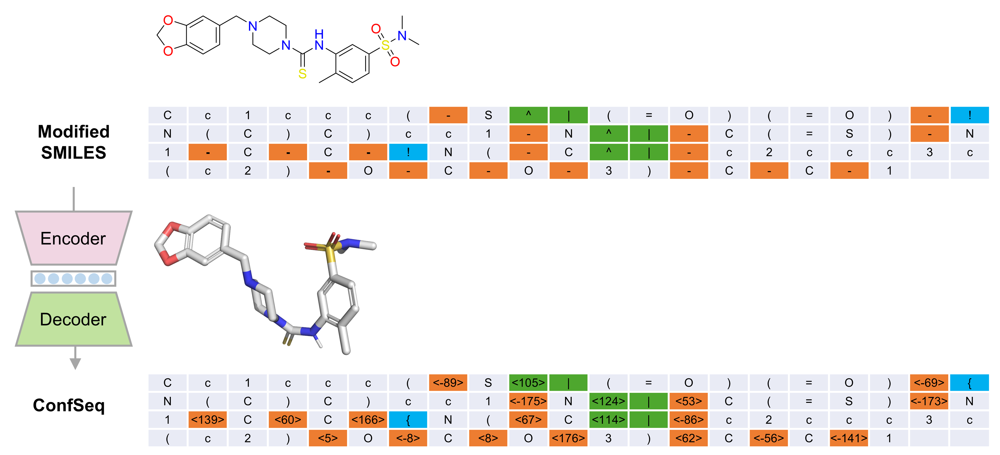

# ConfSeq - Molecular Conformation Prediction 

This directory contains the code and configuration files for the 3D molecular conformation prediction module of **ConfSeq**.

> [!Note]
> Ensure all commands below are executed inside the `confseq` Conda environment, with your working directory set to `conformation_prediction`.

---
## 📦 Data Preparation

We use the **GEOM-Drugs** dataset to train and evaluate our model.  The original data were downloaded from [this repository](https://github.com/OdinZhang/SDEGen).  Alternatively, you can download the raw data from  [this link](https://1drv.ms/f/c/940c94b59e54c472/EhjVMQa_TCpBnieB5MYRNJMBihav3B0wJ29_qtaBj1IXeQ?e=9D2p03).

After downloading, place the files inside the `raw_data` folder. The expected folder structure is as follows:

```
.
└── raw_data/
    ├── train_data_39k.pkl
    ├── val_data_5k.pkl
    └── test_data_200.pkl
```

To convert the raw data into ConfSeq-formatted text files, run:

``` bash
python process_raw_data.py
```

The generated files will be saved in the `processed_data` folder.  Alternatively, you may download the processed results from [this link](https://1drv.ms/f/c/940c94b59e54c472/EjcPXApiXsxHtWg6ovV8IZwBY2WWsa09wmpDJ8d4CmkJIw?e=8BXUqH) and place them in the `processed_data` folder. The expected folder structure is as follows:
```
.
└── processed_data/
    ├── train_data_39k_ConfSeq_aug_0.txt
    ├── train_data_39k_ConfSeq_aug_1.txt
    ├── train_data_39k_ConfSeq_aug_2.txt
    ├── val_data_5k_ConfSeq.txt
    ├── test_data_200_in_smiles_aug_0.json
    ├── test_data_200_in_smiles_aug_1.json
    └── test_data_200_in_smiles_aug_2.json
```

---
## 🏋️ Model Training

To train the conformation prediction model, run:

```bash
accelerate launch --multi_gpu --mixed_precision fp16 --num_processes 4 train_model.py
```

Alternatively, you may download a pre-trained model checkpoint from [this link](https://1drv.ms/f/c/940c94b59e54c472/EmIGxYLJXptOkSC_ZrG2LJUBMhlxR--jsK6Y4bk_kd6tXQ?e=e3V1n5).

---
## 🤖 Inference

To perform inference using different sampling temperatures, run:

```bash
python infer_and_evaluate_temperature_series.py
```

The generated files will be saved in the `prediction_data` folder. Alternatively, you may download the inference results from [this link](https://1drv.ms/f/c/940c94b59e54c472/Eh-lN8-bxjJDhRHiFoGL9AMB4YUaAGKHBcw2IE_Bgz8dxw?e=yTz6OUk) and place them in the `prediction_data` folder. 

---

## 📊 Evaluation

To evaluate all generated results in the `prediction_data` folder, run:

```bash
python eval_all.py
```

The generated files will be saved in the `prediction_data` folder.
