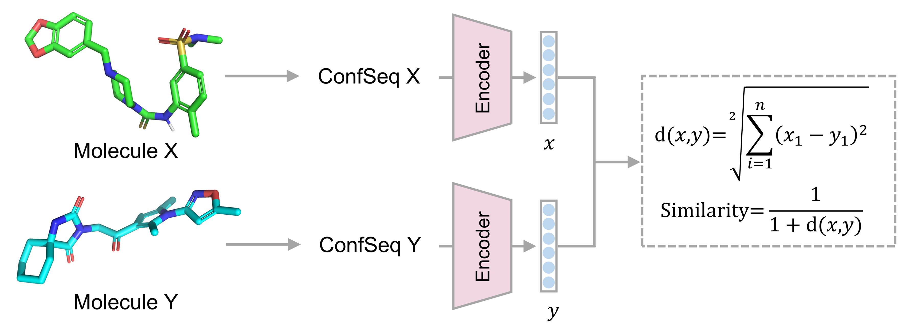

# ConfSeq - 3D molecular representation learning

This directory contains the code and configuration files for the 3D molecular representation learning module of **ConfSeq**.


> [!Note]
> Ensure all commands below are executed inside the `confseq` Conda environment, with your working directory set to `representation_learning`.

---
## 📦 Data Preparation

We use the **DUD-E** and **PCBA** datasets to evaluate the virtual screening capability of the model.  
Additionally, molecular pair similarity data for model training are generated using **RDKit** and **LSalign**.

Raw and processed datasets can be downloaded from [this link](https://1drv.ms/f/c/940c94b59e54c472/Ev9je1Q3Y2FMtL6tyvrDkgUBEMDUNuRlVFuydOPFM5mVNw?e=quBnOT).

After downloading, extract the archive and place its contents inside the `data` folder.  
The expected folder structure is as follows:

```
.
├── README.md
├── infer_for_DUDE.ipynb
├── infer_for_PCBA.ipynb
├── view_PDB_embdding.ipynb
├── train.py
├── data
│   ├── DUDE
│   ├── PCBA
│   ├── PDB
│   └── Pairwise_molecular_similarity
├── checkpoints
    └── model_epoch_1.pth
└── assets
    └── overview.png
```

---
## 🏋️ Model Training

To train the representation learning model, run:

```
accelerate launch --multi_gpu --mixed_precision fp16 --num_processes 4 train.py
```

Alternatively, you may download a pre-trained model checkpoint from [this link](https://1drv.ms/f/c/940c94b59e54c472/Esl0IQNq44BIneU_K80LCmMBA02BJcstSDygUk8vJfQQjw?e=ezX4tc).

---
## 📊 Evaluation

To perform the evaluation, please run the `infer_for_DUDE.ipynb` and `infer_for_PCBA.ipynb` notebooks.

---
## 🎨 Embedding Visualization
To visualize the representations of ligands in the PDB, run `view_PDB_embdding.ipynb` notebooks.

