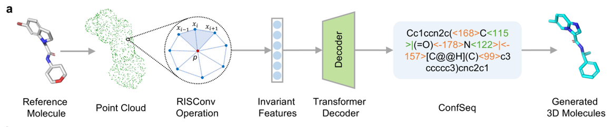

# ConfSeq - Shape-conditioned Generation

This directory contains the code and configuration files for the **shape-conditioned molecular generation module** of ConfSeq.



> [!Note]
> All commands below must be executed inside the `confseq` Conda environment. Ensure your working directory is set to `shape_conditioned_generation`.

---

## 📦 Data Preparation

We adopt the **MOSES** dataset for unconditional molecular generation, following the same data split strategy as the [DiffSMol paper](https://www.nature.com/articles/s42256-025-01030-w).

1. **Download the Dataset**
   Download the dataset and place it in the `data/MOSES/` directory. You can obtain the dataset from [this link](https://1drv.ms/f/c/940c94b59e54c472/Eo60wOizE3VLqq-HSv1a2vgBhe6HdFTb7aSMtw7OToTu-w?e=lN6Ofp).

2. **Preprocess the Dataset**
   Generate the molecular surface point clouds and corresponding ConfSeq representations by executing:

   ```bash
   bash scripts/preprocess.sh
   ```

> [!Caution]
> During point cloud sampling, issues may arise with the `oddt` library. To avoid these, modify the source code of `oddt`. Specifically, open the definition of `oddt.surface.generate_surface_marching_cubes` and replace:
>
> ```python
> try:
>     from skimage.morphology import ball, binary_closing
>     from skimage import __version__ as skimage_version
>     if LooseVersion(skimage_version) >= LooseVersion('0.13'):
>         from skimage.measure import marching_cubes_lewiner as marching_cubes
>     else:
>         from skimage.measure import marching_cubes
> except ImportError as e:
>     warnings.warn('scikit-image could not be imported and is required for'
>                   'generating molecular surfaces.')
>     skimage = None
> ```
>
> with:
>
> ```python
> try:
>     from skimage.morphology import ball, binary_closing
>     from skimage import __version__ as skimage_version
>     # if LooseVersion(skimage_version) >= LooseVersion('0.13'):
>     #     from skimage.measure import marching_cubes_lewiner as marching_cubes
>     # else:
>     from skimage.measure import marching_cubes
> except ImportError as e:
>     warnings.warn('scikit-image could not be imported and is required for'
>                   'generating molecular surfaces.')
>     skimage = None
> ```

Upon successful execution, the processed dataset will be available under `data/`, ready for model training and evaluation. Alternatively, you can directly download the preprocessed datasets from [this link](https://1drv.ms/f/c/940c94b59e54c472/Ek3_WenRvLVEs8WFi8jUjqQBSFNt7OchMPgiprm_wBF8iw?e=QTzWZ9).

---

## 🏋️ Model Training

To train the shape-conditioned generation model, execute:

```bash
bash scripts/train_surfbart.sh
```

A pretrained model checkpoint can also be downloaded from [this link](https://1drv.ms/f/c/940c94b59e54c472/EjUXe9kpMTRJj4LQSMT-coUBxK9_TvuVYHpmzajT-ewbfQ?e=olMAH8).

---

## 🌱 Molecule Generation

To generate molecules using the trained model, run:

```bash
bash scripts/sample_confseq.sh
```

---

## 📊 Evaluation

We evaluate the shape similarity between generated molecules and reference molecules using **ShaEP**, as recommended by [SQUID](https://github.com/keiradams/SQUID). You can download ShaEP from [this link](https://users.abo.fi/mivainio/shaep/index.php) or use the executable provided in the `software` directory.

To perform the evaluation, run:

```bash
bash scripts/evaluate_confseq.sh
```